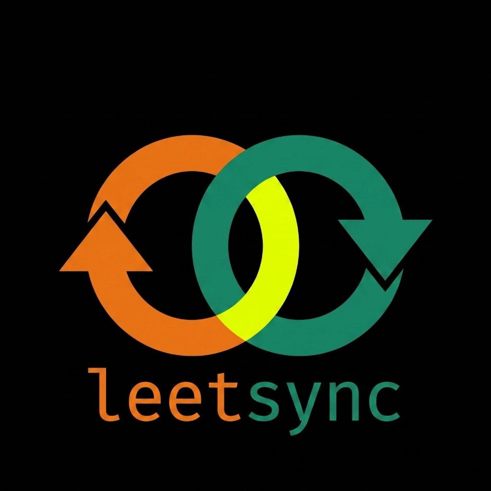

<p align="center">
  
</p>

<h1 align="center">LeetSync</h1>

<p align="center">
  <strong>Sync your LeetCode solutions to GitHub — automatically and securely.</strong>
</p>

<p align="center">
  <a href="https://MohdAltamish.github.io/LeetSync"></a>
  <a href="downloads/leetsync-extension.zip"></a>
  <a href="https://github.com/apps/leetsync-app/installations/new"></a>
  
  
  
</p>

---

## 🌟 Overview

**LeetSync** is a lightweight, privacy-focused Chrome Extension (Manifest V3) that automatically detects when your LeetCode submission receives an **Accepted** verdict and instantly pushes your code + a clean `README.md` to your designated GitHub repository.

Unlike legacy extensions that demand blanket access to all your public and private repositories, LeetSync connects via a dedicated **GitHub App** that grants access **only to the specific repository you choose** (e.g., `LeetCode-DSA`).

🌐 **Live Showcase & Web UI:** [https://MohdAltamish.github.io/LeetSync](https://MohdAltamish.github.io/LeetSync)  
📦 **Direct Download (.zip):** [Download Latest `leetsync-extension.zip`](downloads/leetsync-extension.zip)  
🔗 **Official GitHub App:** [https://github.com/apps/leetsync-app](https://github.com/apps/leetsync-app)  
🚀 **Direct Install Link:** [https://github.com/apps/leetsync-app/installations/new](https://github.com/apps/leetsync-app/installations/new)

---

## ⚡ Quick 3-Step Installation & Setup

Because LeetSync is open-source and free of blanket tracking, you can install it into Google Chrome in under 60 seconds:

```
┌────────────────────────────────┐     ┌────────────────────────────────┐     ┌────────────────────────────────┐
│  1. Download & Unzip           │ ──> │  2. Load into Chrome           │ ──> │  3. Pair with GitHub           │
│  Get leetsync-extension.zip    │     │  chrome://extensions           │     │  One-click device code auth    │
│  Extract to a local folder     │     │  Developer Mode -> Unpacked    │     │  Select only LeetCode repo     │
└────────────────────────────────┘     └────────────────────────────────┘     └────────────────────────────────┘
```

### Step 1: Download the Extension
- [**Download `leetsync-extension.zip`**](downloads/leetsync-extension.zip) directly from this repository or from the [LeetSync Web Showcase](https://MohdAltamish.github.io/LeetSync).
- Extract / Unzip the downloaded file on your computer.

### Step 2: Load into Google Chrome
1. In Google Chrome, open a new tab and navigate to:
   ```text
   chrome://extensions
   ```
2. In the top-right corner, switch the **Developer mode** toggle to **ON**.
3. In the top-left menu, click the **Load unpacked** button.
4. Select the unzipped `leetsync-extension` folder (the folder containing `manifest.json`).
5. You will see **LeetSync** appear in your extension list! Click the puzzle icon 🧩 in your Chrome toolbar and pin 📌 **LeetSync**.

### Step 3: Connect with GitHub
1. Click the **LeetSync** extension icon in your Chrome toolbar.
2. Click **"Connect with GitHub"** (the unique device authorization code is auto-copied to your clipboard).
3. In the GitHub window that opens:
   - Paste the code and click **Continue**.
   - Select **"Only select repositories"** and choose your DSA repository (e.g., `LeetCode-DSA`).
   - Click **Authorize**.
4. In the extension popup, select your repository from the dropdown and click **Start Syncing →**!

> 🎉 **You're all set!** Solve any LeetCode problem. As soon as you hit **Accepted**, your solution and runtime beats documentation are committed to GitHub in real time.

---

## ✨ Features

- 🔒 **Granular Privacy:** Powered by GitHub Apps — grants access **strictly to the repository you pick**, keeping all your other repositories completely hidden and protected.
- ⚡ **Automatic Background Sync:** Intercepts LeetCode submission calls directly in the browser; pushes code silently without freezing your editor or slowing down the tab.
- 📊 **Live Stats & Difficulty Breakdown:** Tracks your day streak, average solve time, and exact **Easy**, **Medium**, and **Hard** solve counts.
- 🔄 **Multi-Format Backward Compatibility:** Recognizes solutions synced with both native LeetSync and legacy LeetHub templates.
- 📁 **Clean Folder Organization:** Automatically organizes solutions into zero-padded folders (`0001-two-sum/`) with formatted problem descriptions, metrics, and percentiles.
- ⏱ **Problem Duration Stopwatch:** Accurately measures solve duration from the moment you open the problem until acceptance.
- ⚙️ **Customizable Settings:** Option to skip re-submissions, toggle auto-sync, or switch repositories anytime.

---

## 📁 Repository Structure (Output)

```text
your-leetcode-repo/
├── 0001-two-sum/
│   ├── README.md
│   └── solution.py
├── 0020-valid-parentheses/
│   ├── README.md
│   └── solution.java
└── 0412-fizz-buzz/
    ├── README.md
    └── solution.cpp
```

Each problem folder contains:
1. **`solution.<ext>`**: Your exact accepted code in the language you solved it in (Python, C++, Java, JS, TS, Rust, Go, etc.).
2. **`README.md`**: Problem statement, difficulty badge, runtime beats, memory beats, and direct LeetCode problem link.

---

## 🔑 Alternative Setup: Personal Access Token (PAT)

If you prefer using tokens instead of the GitHub App:
1. Open [GitHub Fine-Grained Tokens](https://github.com/settings/personal-access-tokens/new).
2. Under **Repository access**, select **"Only select repositories"** and choose your target repository.
3. Under **Permissions → Repository permissions**, set **Contents** to **Read and write**.
4. Generate the token and paste it into the **"Personal Access Token"** field in the LeetSync popup.

---

## 🛠️ Architecture & Tech Stack

| Layer | Component | Details |
| :--- | :--- | :--- |
| **Extension Standard** | Manifest V3 | Service worker background architecture |
| **Interception** | Fetch Hooking | Intercepts LeetCode submission endpoints with 0 DOM scraping |
| **Data Fetching** | LeetCode GraphQL API | Retrieves title, difficulty, description & performance percentiles |
| **GitHub Integration**| GitHub REST API & Apps | Authenticates via Device Flow and commits files via Git Trees API |
| **Storage** | Chrome Storage Sync & Local | Encrypts and persists tokens, active streaks, and timestamps |

---

## 📄 License & Privacy

- **License:** Open sourced under the [MIT License](LICENSE).
- **Privacy Policy:** Read our complete [Privacy Policy](PRIVACY.md). Zero user data or code is ever collected, transmitted to third parties, or saved to external databases.
